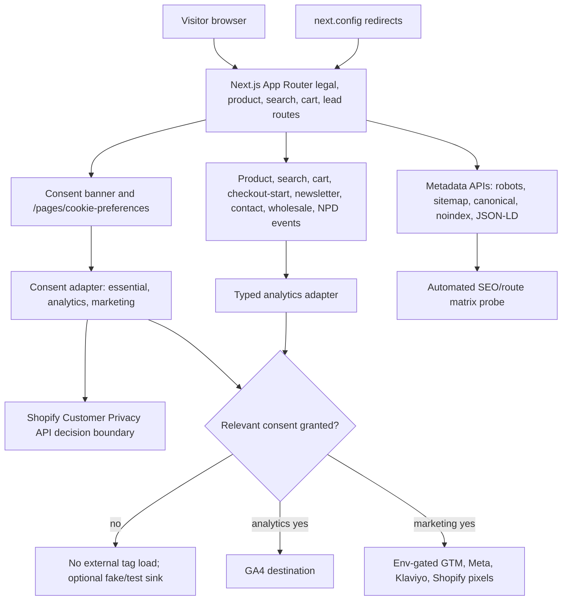

# Phase 16: Legal, Consent, Analytics, and SEO Launch Coverage - Research

**Researched:** 2026-06-22  
**Domain:** Next.js 16 launch compliance, consent gating, GA4 ecommerce analytics, SEO indexing controls  
**Confidence:** HIGH

<user_constraints>
## User Constraints (from CONTEXT.md)

This section is copied from `.planning/phases/teavision-16-legal-consent-analytics-and-seo-launch-coverage/16-CONTEXT.md`; these decisions constrain the implementation plan. [VERIFIED: .planning/phases/teavision-16-legal-consent-analytics-and-seo-launch-coverage/16-CONTEXT.md]

### Locked Decisions

- D-01: Use code-owned static legal/policy pages for launch coverage; Shopify policy/page content can remain a reference source, but launch routing and approval state must be explicit in the repo.
- D-02: Canonical headless legal page URLs are `/pages/privacy-policy`, `/pages/shipping-policy`, `/pages/refund-policy`, `/pages/terms-of-service`, and `/pages/cookie-preferences`.
- D-03: `/policies/*` and legacy Shopify policy HTML URLs must resolve by redirecting to canonical headless URLs, not by serving separate duplicate content.
- D-04: Pending owner/legal review can ship behind visible "pending owner/legal review" banners on legal/policy pages until approval is recorded; the planner must preserve that state rather than silently presenting placeholders as final legal advice.
- D-05: Full launch policy set is blocking: privacy, terms, shipping, returns/refunds, cookie preferences, compliance/privacy rights coverage where applicable, footer legal links, `/policies/*`, and legacy Shopify policy HTML URLs.
- D-06: `/pages/cookie-preferences` must be a stable visitor-facing route that opens or embeds the consent preferences experience.
- D-07: Track policy readiness with an approval matrix that records URL, implementation status, owner/legal approval state, last-reviewed date, and proof/evidence.
- D-08: Add automated route-matrix verification for legal/policy URLs covering status codes, redirects, canonical metadata, noindex behavior, footer link coverage, and no 404s.
- D-09: Consent model must deny non-essential tracking by default; analytics and marketing tags must not load until the relevant consent grant exists.
- D-10: First-visit consent UX must be a banner with Accept, Reject, and Manage actions.
- D-11: Consent preferences must be changeable after first choice through a modal/page flow backed by `/pages/cookie-preferences`.
- D-12: Consent categories for launch are essential, analytics, and marketing.
- D-13: Shopify Customer Privacy API integration must be evaluated and wired through the centralized consent adapter where applicable, or explicitly documented as not applicable for this headless storefront.
- D-14: Launch analytics priority is GA4. GTM, Meta, Klaviyo, and Shopify pixels should be environment-gated or documented as disabled until approved destination IDs exist.
- D-15: Analytics event coverage for launch must include product view, search, add-to-cart, cart update, checkout start, newsletter signup, contact enquiry submit, wholesale enquiry submit, and NPD enquiry submit.
- D-16: Analytics must use a typed, consent-aware adapter with a fake/test sink so local tests and CI never send production analytics events.
- D-17: Checkout-start analytics can be implemented locally; purchase/order analytics are owner-gated and must remain documented rather than exercised against live checkout/order flows.
- D-18: Launch runbook must include pre-cutover and post-cutover analytics destination verification steps, with destination IDs sourced from environment variables and no client secrets.
- D-19: Keep `DISABLE_INDEXING` as an explicit indexing gate; add tests/evidence for disabled and enabled launch modes.
- D-20: Add automated SEO route-matrix verification for robots, sitemap, canonicals, noindex, structured data, and policy redirects.
- D-21: Expand sitemap coverage to legal pages plus key static landing/service pages, including owner-authored bespoke landing pages.
- D-22: Search Console submission/access is owner-gated: document property/submission/check/post-cutover inspection steps, but do not make code completion depend on Search Console unless owner access is granted.

### the agent's Discretion

No selected area was left to the agent's discretion.

### Deferred Ideas (OUT OF SCOPE)

None - discussion stayed within launch-blocking legal, consent, analytics, SEO, and runbook coverage.
</user_constraints>

<phase_requirements>
## Phase Requirements

| ID | Description | Research Support |
|----|-------------|------------------|
| LEGAL-01 | Legal and policy pages must resolve without 404s and expose launch approval state. | Use code-owned static canonical `/pages/*` routes, visible pending-review banners, footer links, and an approval matrix. [VERIFIED: .planning/REQUIREMENTS.md] [VERIFIED: .planning/phases/teavision-16-legal-consent-analytics-and-seo-launch-coverage/16-CONTEXT.md] |
| LEGAL-02 | Shopify policy and legacy policy URLs must redirect or resolve to the headless canonical pages. | Add static permanent redirects for `/policies/*` and legacy policy HTML URLs to canonical `/pages/*` pages. [VERIFIED: .planning/REQUIREMENTS.md] [CITED: node_modules/next/dist/docs/01-app/04-api-reference/05-config/01-next-config-js/redirects.md] |
| SEO-01 | Launch indexing must be switchable and verified across robots, sitemap, canonicals, noindex, and structured data. | Preserve `DISABLE_INDEXING`, expand `sitemap.ts`, verify `robots.ts`, add canonical route matrix and structured-data checks. [VERIFIED: src/app/robots.ts] [VERIFIED: src/app/sitemap.ts] [CITED: https://developers.google.com/search/docs/crawling-indexing/block-indexing] |
| CONSENT-01 | Consent defaults must block non-essential tracking before analytics or marketing tags can load. | Initialize denied consent defaults and only load GA4/GTM/marketing destinations after category-specific grants. [VERIFIED: .planning/phases/teavision-16-legal-consent-analytics-and-seo-launch-coverage/16-CONTEXT.md] [CITED: https://developers.google.com/tag-platform/security/guides/consent] |
| CONSENT-02 | Consent preferences must be user-changeable and include a Shopify Customer Privacy API decision. | Implement banner plus `/pages/cookie-preferences`, centralize state in a consent adapter, and call or explicitly rule out Shopify Customer Privacy API. [CITED: https://shopify.dev/docs/api/customer-privacy] |
| ANALYTICS-01 | Ecommerce and lead events must be emitted through a typed consent-aware adapter. | Create a typed event union and route product, search, cart, checkout-start, newsletter, contact, wholesale, and NPD events through the adapter. [VERIFIED: src/components/product/use-add-to-cart.ts] [VERIFIED: src/lib/contact/actions.ts] [CITED: https://developers.google.com/analytics/devguides/collection/ga4/ecommerce] |
| ANALYTICS-02 | Local tests and CI must not send production analytics events. | Add fake/test sink and env-gated destination loading; keep real destination IDs out of CI. [VERIFIED: .planning/REQUIREMENTS.md] [VERIFIED: package.json] |
| ANALYTICS-03 | Launch runbook must include analytics destination verification before and after cutover. | Document GA4 DebugView/Tag Assistant or approved-destination checks, with Search Console owner-gated separately. [CITED: https://developers.google.com/tag-platform/security/guides/consent-debugging] [VERIFIED: .planning/phases/teavision-16-legal-consent-analytics-and-seo-launch-coverage/16-CONTEXT.md] |
</phase_requirements>

## Project Constraints (from AGENTS.md)

- Read the relevant Next.js guide in `node_modules/next/dist/docs/` before writing implementation code because this project uses Next.js 16 with breaking API and convention changes. [VERIFIED: AGENTS.md]
- Use `pnpm dev`, `pnpm build`, `pnpm lint`, `pnpm format`, `pnpm codegen`, and `pnpm storybook` as the project commands. [VERIFIED: AGENTS.md]
- Storybook remains preferred for component documentation; Phase 10 exceptions allow `pnpm test:unit`, `pnpm test:integration`, and `pnpm test:e2e` for revenue-critical cart and checkout-handoff coverage. [VERIFIED: AGENTS.md]
- Do not run real Shopify hosted checkout, payment, shipping-rate, tax, order-creation, or success-redirect tests until the Shopify dev store is configured and the store owner explicitly approves checkout testing. [VERIFIED: AGENTS.md]
- Storefront data flows through Server Components, `src/lib/shopify/operations/*`, `shopifyFetch()`, GraphQL queries in `src/lib/shopify/queries/*.graphql`, and generated types re-exported through `src/lib/shopify/types/index.ts`. [VERIFIED: AGENTS.md]
- Cart state lives in the `teavision_cart` cookie; cart mutations are Server Actions in `src/lib/cart/actions.ts`. [VERIFIED: AGENTS.md]
- Expensive product and collection fetches use Next.js 16 Cache Components with `'use cache'`, `cacheTag()`, and `cacheLife()`. [VERIFIED: AGENTS.md]
- Storefront routes live under `src/app/(storefront)/`; dynamic segments use `params: Promise<{...}>` and must await `params` before destructuring. [VERIFIED: AGENTS.md] [CITED: node_modules/next/dist/docs/01-app/03-api-reference/04-functions/generate-metadata.md]
- Use `'use client'` only on interactive leaves and `'use server'` on Server Action files. [VERIFIED: AGENTS.md]
- Style with Tailwind 4 utilities and project design tokens from `app/globals.css`; use `cn()` from `@/lib/utils` for class composition. [VERIFIED: AGENTS.md]
- Do not introduce cool grays, raw hex/rgb values in className, CSS modules, styled-components, inline `style={{}}`, class string concatenation, `any`, default exports for components/lib modules, or direct imports from generated Shopify types. [VERIFIED: AGENTS.md]
- Keep application code under `src/`; do not recreate root-level `app/`, `components/`, or `lib/`. [VERIFIED: AGENTS.md]
- Before adding files, check for existing equivalents, use the folder map in `docs/conventions.md`, add stories for components under `src/components/`, and prefer `pnpm create:component` or `pnpm create:lib` scaffolding. [VERIFIED: AGENTS.md] [VERIFIED: docs/conventions.md]

## Summary

Phase 16 should be planned as a launch-readiness layer around existing storefront routes rather than a redesign or Shopify-hosted policy migration. The repo already has `DISABLE_INDEXING`, `robots.ts`, `sitemap.ts`, canonical metadata helpers, static terms content, a generic Shopify page catch-all, footer legal links, product JSON-LD, contact/lead Server Actions, cart actions, and Phase 15 CSP infrastructure; the plan should extend those seams with code-owned policy routes, explicit redirects, consent state, analytics destinations, and verification probes. [VERIFIED: src/app/robots.ts] [VERIFIED: src/app/sitemap.ts] [VERIFIED: src/lib/seo/noindex.ts] [VERIFIED: src/components/layout/footer/data.ts] [VERIFIED: src/app/(storefront)/pages/terms-conditions/page.tsx] [VERIFIED: src/lib/security/headers.ts]

The highest-risk planning decision is ordering: consent defaults and destination gating must be implemented before any analytics destination scripts are allowed, and CSP host expansions must stay env-gated until the consent-aware adapter is ready. Google documentation requires denied defaults to be set before relevant tags and consent updates to happen when the user grants or denies categories; Shopify documents a Customer Privacy API for headless storefront consent state that can be loaded with `window.Shopify.loadFeatures()` and queried or updated through a visitor consent API. [CITED: https://developers.google.com/tag-platform/security/guides/consent] [CITED: https://developers.google.com/tag-platform/security/guides/consent-debugging] [CITED: https://shopify.dev/docs/api/customer-privacy]

**Primary recommendation:** Plan a central `src/lib/consent` plus `src/lib/analytics` foundation first, then wire legal routes, redirects, SEO probes, event emission points, CSP host gates, and launch-runbook evidence on top of that foundation. [VERIFIED: .planning/phases/teavision-16-legal-consent-analytics-and-seo-launch-coverage/16-CONTEXT.md] [VERIFIED: docs/conventions.md]

## Architectural Responsibility Map

| Capability | Primary Tier | Secondary Tier | Rationale |
|------------|--------------|----------------|-----------|
| Code-owned legal/policy pages | Frontend Server (SSR/RSC) | Browser / Client for consent preferences UI | Legal routes are Next App Router pages with metadata and banners; only consent preference controls require client interactivity. [VERIFIED: src/app/(storefront)/pages/terms-conditions/page.tsx] [VERIFIED: AGENTS.md] |
| Legacy Shopify policy redirects | CDN / Static via Next redirects | Frontend Server | `next.config.ts` redirects run before filesystem routes and are the standard home for static permanent route migrations. [VERIFIED: next.config.ts] [CITED: node_modules/next/dist/docs/01-app/04-api-reference/05-config/01-next-config-js/redirects.md] |
| Indexing controls | Frontend Server (metadata routes) | CDN / Static | `robots.ts`, `sitemap.ts`, and metadata APIs own robots, sitemap, canonical, and noindex behavior. [VERIFIED: src/app/robots.ts] [VERIFIED: src/app/sitemap.ts] [CITED: node_modules/next/dist/docs/01-app/03-api-reference/03-file-conventions/01-metadata/robots.md] |
| Consent storage and preferences | Browser / Client | Frontend Server for cookie preferences route shell | Visitor decisions happen in the browser; the page route provides a stable URL for reopening or embedding preferences. [VERIFIED: .planning/phases/teavision-16-legal-consent-analytics-and-seo-launch-coverage/16-CONTEXT.md] [CITED: https://shopify.dev/docs/api/customer-privacy] |
| Shopify Customer Privacy API integration | Browser / Client | External Shopify service boundary | Shopify exposes the Customer Privacy API as a browser API loaded through `window.Shopify.loadFeatures()`. [CITED: https://shopify.dev/docs/api/customer-privacy] |
| Analytics event normalization | Browser / Client for client interactions | Frontend Server for server-rendered event data inputs | Product, search, cart, checkout-start, and lead events must pass through a typed consent-aware client adapter before destination dispatch. [VERIFIED: src/components/product/use-add-to-cart.ts] [VERIFIED: src/app/(storefront)/cart/_components/checkout-form.tsx] |
| GA4/GTM/marketing destination loading | Browser / Client | CDN / Static for CSP host allowlist | External destination scripts are browser-loaded and must be consent- and environment-gated; CSP headers must allow only approved hosts. [VERIFIED: src/lib/security/headers.ts] [CITED: https://developers.google.com/tag-platform/security/guides/consent] |
| Launch runbook evidence | Documentation / Process | API / Backend only for probes | Search Console and destination verification are owner-gated operational checks, while route and SEO behavior can be automated locally. [VERIFIED: .planning/REQUIREMENTS.md] [VERIFIED: .planning/phases/teavision-16-legal-consent-analytics-and-seo-launch-coverage/16-CONTEXT.md] |

## Standard Stack

### Core

| Library / Platform | Version | Purpose | Why Standard |
|--------------------|---------|---------|--------------|
| Next.js App Router | Installed `16.2.9`; npm current `16.2.9`, modified 2026-06-21 | Legal routes, redirects, metadata, robots, sitemap, `next/script`, security headers | This is the project framework, and local Next 16 docs define the active file conventions. [VERIFIED: package.json] [VERIFIED: npm view next version time.modified] [CITED: node_modules/next/dist/docs/01-app/03-api-reference/03-file-conventions/01-metadata/sitemap.md] |
| React | Installed `19.2.4`; npm current `19.2.7`, modified 2026-06-19 | Consent banner/preferences and small analytics client leaves | The project is already on React 19; do not make dependency upgrades part of this phase unless a build failure requires it. [VERIFIED: package.json] [VERIFIED: npm view react version time.modified] |
| Tailwind CSS | Installed `4.2.4`; npm current `4.3.1`, modified 2026-06-19 | Policy page banners and consent UI styling | The project mandates Tailwind 4 utilities and design tokens; phase work should use existing token classes. [VERIFIED: package.json] [VERIFIED: npm view tailwindcss version time.modified] [VERIFIED: AGENTS.md] |
| Shopify Customer Privacy API | `consent-tracking-api` version `0.1` in Shopify docs | Headless storefront visitor consent integration and Shopify privacy state | Shopify documents this browser API for custom storefronts and checkout privacy propagation. [CITED: https://shopify.dev/docs/api/customer-privacy] |
| Google tag / GA4 | External destination, no npm package required | GA4 launch ecommerce and lead-event measurement | Google documents consent commands, ecommerce events, and recommended events through the tag platform and GA4 Measurement APIs. [CITED: https://developers.google.com/tag-platform/gtagjs/reference] [CITED: https://developers.google.com/analytics/devguides/collection/ga4/ecommerce] |

### Supporting

| Library / Tool | Version | Purpose | When to Use |
|----------------|---------|---------|-------------|
| Vitest | Installed `4.1.8`; npm current `4.1.9`, modified 2026-06-15 | Consent adapter, analytics adapter, route matrix helper, metadata helpers | Use for fast unit and integration checks that do not hit real analytics or Shopify checkout. [VERIFIED: package.json] [VERIFIED: vitest.config.mts] [VERIFIED: npm view vitest version time.modified] |
| Playwright | Installed `1.60.0`; npm current `1.61.0`, modified 2026-06-22 | Fake-Shopify browser checks for consent UI and checkout-start handoff | Use only against local fake Shopify and never for real hosted checkout/payment/order flows. [VERIFIED: package.json] [VERIFIED: playwright.config.ts] [VERIFIED: npm view @playwright/test version time.modified] [VERIFIED: AGENTS.md] |
| Node test runner | Node `v22.18.0` locally | Contract scripts for SEO, noindex, security headers, CSP, and route matrices | The repo already uses Node scripts for component contracts and production security probes. [VERIFIED: local command probe 2026-06-22] [VERIFIED: package.json] [VERIFIED: scripts/component-contracts/noindex-mode.test.mjs] |
| Storybook Next Vite | Installed/current `10.4.6`, npm modified 2026-06-22 | Consent banner and preferences component documentation | Add stories for new reusable UI components under `src/components/`. [VERIFIED: package.json] [VERIFIED: npm view @storybook/nextjs-vite version time.modified] [VERIFIED: AGENTS.md] |
| Existing CSP helper | Project module | Script/connect host allowlisting for analytics destinations | Extend `src/lib/security/headers.ts` only after consent/env gates are in place. [VERIFIED: src/lib/security/headers.ts] [VERIFIED: .planning/phases/15-security-dependency-and-runtime-header-hardening/15-RESEARCH.md] |

### Alternatives Considered

| Instead of | Could Use | Tradeoff |
|------------|-----------|----------|
| Code-owned policy routes | Shopify-hosted policies as primary pages | Rejected by locked decisions; Shopify policy content can be reference material, but routing and approval state must be explicit in the repo. [VERIFIED: .planning/phases/teavision-16-legal-consent-analytics-and-seo-launch-coverage/16-CONTEXT.md] |
| Central consent adapter | Destination-specific consent checks in each component | Centralization prevents tags from loading early and keeps Shopify, GA4, and marketing destination state consistent. [CITED: https://developers.google.com/tag-platform/security/guides/consent] [CITED: https://shopify.dev/docs/api/customer-privacy] |
| Direct `gtag` calls at event sites | Typed analytics adapter with fake sink | Direct calls are harder to test and can leak production events in CI; locked decisions require a fake/test sink. [VERIFIED: .planning/phases/teavision-16-legal-consent-analytics-and-seo-launch-coverage/16-CONTEXT.md] |
| `@next/third-parties` wrappers | Project-owned `next/script` destination loader | `@next/third-parties` is not present in the repo, and consent gating still has to be implemented explicitly. [VERIFIED: package.json] [CITED: node_modules/next/dist/docs/01-app/02-guides/scripts.md] |
| Real destination verification in tests | Fake sink plus manual approved-destination launch runbook | Real analytics and checkout destinations are owner-gated; automated tests should not send production analytics. [VERIFIED: .planning/REQUIREMENTS.md] [VERIFIED: AGENTS.md] |

**Installation:**

```bash
# No new runtime package is required for the recommended Phase 16 stack.
# Use existing project dependencies and add only source modules, tests, and docs.
```

**Version verification:** The recommended package versions were checked with `npm view` and compared against `package.json`; Next.js and Storybook match current npm versions, while React, Tailwind, Vitest, Playwright, and TypeScript have newer patch/minor releases that should not be folded into this launch phase unless required by failing verification. [VERIFIED: npm view next/react/tailwindcss/vitest/@playwright/test/typescript/@storybook/nextjs-vite version time.modified] [VERIFIED: package.json]

## Architecture Patterns

### System Architecture Diagram



This diagram reflects the locked consent-first destination flow, existing Next metadata route ownership, and Phase 15 CSP host-gating responsibilities. [VERIFIED: .planning/phases/teavision-16-legal-consent-analytics-and-seo-launch-coverage/16-CONTEXT.md] [VERIFIED: src/lib/security/headers.ts] [CITED: node_modules/next/dist/docs/01-app/03-api-reference/03-file-conventions/01-metadata/robots.md]

### Recommended Project Structure

```text
src/
├── app/
│   ├── (storefront)/pages/
│   │   ├── privacy-policy/page.tsx
│   │   ├── shipping-policy/page.tsx
│   │   ├── refund-policy/page.tsx
│   │   ├── terms-of-service/page.tsx
│   │   └── cookie-preferences/page.tsx
│   ├── robots.ts
│   └── sitemap.ts
├── components/
│   └── consent/
│       ├── banner/
│       └── preferences/
├── lib/
│   ├── analytics/
│   │   ├── adapter.ts
│   │   ├── events.ts
│   │   └── destinations/
│   ├── consent/
│   │   ├── adapter.ts
│   │   ├── storage.ts
│   │   └── shopify-customer-privacy.ts
│   ├── legal/
│   │   ├── policies.ts
│   │   └── route-matrix.ts
│   └── seo/
│       └── launch-route-matrix.ts
scripts/
└── seo/
    └── probe-launch-seo.mjs
docs/
└── launch/
    ├── legal-approval-matrix.md
    └── analytics-and-indexing-runbook.md
```

This structure follows existing `src/app`, `src/components`, `src/lib`, and `docs` ownership; exact filenames should avoid redundant directory prefixes and should be scaffolded or checked against `docs/conventions.md` before implementation. [VERIFIED: docs/conventions.md] [VERIFIED: AGENTS.md]

### Pattern 1: Code-Owned Legal Policy Registry

**What:** Define a single legal policy registry with canonical URL, title, approval state, footer inclusion, redirect aliases, and canonical metadata expectations. [VERIFIED: .planning/phases/teavision-16-legal-consent-analytics-and-seo-launch-coverage/16-CONTEXT.md]

**When to use:** Use for `/pages/privacy-policy`, `/pages/shipping-policy`, `/pages/refund-policy`, `/pages/terms-of-service`, `/pages/cookie-preferences`, compliance/privacy-rights coverage, footer links, sitemap inclusion, and route-matrix tests. [VERIFIED: .planning/REQUIREMENTS.md] [VERIFIED: src/components/layout/footer/data.ts]

**Example:**

```typescript
export type LegalPolicyStatus = "draft" | "pending_owner_legal_review" | "approved";

export type LegalPolicy = {
  handle: "privacy-policy" | "shipping-policy" | "refund-policy" | "terms-of-service" | "cookie-preferences";
  href: `/pages/${string}`;
  title: string;
  status: LegalPolicyStatus;
  includeInFooter: boolean;
  redirectSources: readonly string[];
};
```

Source: local Phase 16 context and project conventions. [VERIFIED: .planning/phases/teavision-16-legal-consent-analytics-and-seo-launch-coverage/16-CONTEXT.md] [VERIFIED: docs/conventions.md]

### Pattern 2: Static Redirect Matrix in `next.config.ts`

**What:** Add explicit permanent redirects from Shopify policy paths and legacy HTML URLs to canonical headless pages. [VERIFIED: .planning/phases/teavision-16-legal-consent-analytics-and-seo-launch-coverage/16-CONTEXT.md]

**When to use:** Use for `/policies/privacy-policy`, `/policies/refund-policy`, `/policies/terms-of-service`, `/policies/shipping-policy`, and legacy paths such as `/7868339/policies/refund-policy.html?locale=en-AU` if the current production path shape is confirmed. [VERIFIED: src/app/(storefront)/pages/terms-conditions/_components/terms-conditions-content.tsx] [CITED: https://help.shopify.com/en/manual/checkout-settings/refund-privacy-tos]

**Example:**

```typescript
{
  source: "/policies/privacy-policy",
  destination: "/pages/privacy-policy",
  permanent: true,
}
```

Next.js redirects are configured in `next.config` and are checked before filesystem routes. [CITED: node_modules/next/dist/docs/01-app/04-api-reference/05-config/01-next-config-js/redirects.md]

### Pattern 3: Denied Consent Defaults Before Destination Loading

**What:** Initialize consent categories as denied, expose Accept/Reject/Manage, and only load destination scripts after the visitor grants the relevant category. [VERIFIED: .planning/phases/teavision-16-legal-consent-analytics-and-seo-launch-coverage/16-CONTEXT.md]

**When to use:** Use for GA4 analytics consent and for every marketing destination, including GTM, Meta, Klaviyo, and Shopify pixels if enabled later. [VERIFIED: .planning/phases/teavision-16-legal-consent-analytics-and-seo-launch-coverage/16-CONTEXT.md] [CITED: https://developers.google.com/tag-platform/security/guides/consent]

**Example:**

```typescript
export type ConsentCategories = {
  essential: true;
  analytics: boolean;
  marketing: boolean;
};

export const DEFAULT_CONSENT: ConsentCategories = {
  essential: true,
  analytics: false,
  marketing: false,
};
```

Google documents `gtag('consent', 'default', ...)` and `gtag('consent', 'update', ...)` for consent state; Tag Assistant guidance says defaults must be set before tags fire. [CITED: https://developers.google.com/tag-platform/gtagjs/reference] [CITED: https://developers.google.com/tag-platform/security/guides/consent-debugging]

### Pattern 4: Shopify Customer Privacy API Boundary

**What:** Hide `window.Shopify.loadFeatures()` and visitor consent mapping inside `src/lib/consent/shopify-customer-privacy.ts`, then call it only from a browser client leaf. [CITED: https://shopify.dev/docs/api/customer-privacy]

**When to use:** Use when applying or reading consent state for Shopify pixels, Shopify analytics, audiences, or checkout privacy propagation; document not-applicable only if Shopify setup cannot be configured for this headless storefront. [CITED: https://shopify.dev/docs/api/customer-privacy]

**Example:**

```typescript
export type ShopifyConsentInput = {
  analytics: boolean;
  marketing: boolean;
  preferences: boolean;
};

export async function applyShopifyConsent(consent: ShopifyConsentInput): Promise<void> {
  // Browser-only wrapper around Shopify Customer Privacy API.
}
```

Shopify examples for headless storefronts include `headlessStorefront`, checkout/storefront root domains, and a storefront access token when setting tracking consent. [CITED: https://shopify.dev/docs/api/customer-privacy]

### Pattern 5: Typed Consent-Aware Analytics Adapter

**What:** Define a closed event union, normalize event payloads, and dispatch to destinations through one adapter that checks consent and environment configuration. [VERIFIED: .planning/phases/teavision-16-legal-consent-analytics-and-seo-launch-coverage/16-CONTEXT.md]

**When to use:** Use for product view, search, add-to-cart, cart update, checkout start, newsletter signup, contact enquiry submit, wholesale enquiry submit, and NPD enquiry submit. [VERIFIED: .planning/phases/teavision-16-legal-consent-analytics-and-seo-launch-coverage/16-CONTEXT.md]

**Example:**

```typescript
export type AnalyticsEvent =
  | { name: "product_view"; productId: string; handle: string; title: string }
  | { name: "search"; query: string; resultCount: number }
  | { name: "add_to_cart"; variantId: string; quantity: number }
  | { name: "cart_update"; action: "quantity" | "remove"; lineId: string }
  | { name: "checkout_start"; cartIdPresent: boolean }
  | { name: "lead_submit"; kind: "newsletter" | "contact" | "wholesale" | "npd" };
```

GA4 ecommerce docs recommend ecommerce events with item data, and GA4 recommended events include lead-generation style events for form submissions. [CITED: https://developers.google.com/analytics/devguides/collection/ga4/ecommerce] [CITED: https://developers.google.com/analytics/devguides/collection/ga4/reference/events]

### Pattern 6: SEO Launch Matrix Probe

**What:** Add a deterministic probe that can run in disabled-indexing and launch-indexing modes to assert robots, sitemap, canonical, noindex, structured data, policy redirects, and no 404s. [VERIFIED: .planning/phases/teavision-16-legal-consent-analytics-and-seo-launch-coverage/16-CONTEXT.md]

**When to use:** Use as a phase gate and as runbook evidence before `$gsd-verify-work`. [VERIFIED: .planning/REQUIREMENTS.md]

**Example:**

```typescript
export type LaunchSeoRouteExpectation = {
  path: string;
  expectedStatus: 200 | 301 | 307 | 308;
  canonicalPath?: string;
  shouldIndexWhenEnabled: boolean;
  shouldAppearInSitemap: boolean;
};
```

Google documents that `robots.txt` manages crawling rather than guaranteed indexing, while `noindex` must be visible to crawlers and canonical signals can come from redirects, `rel=canonical`, and sitemap inclusion. [CITED: https://developers.google.com/search/docs/crawling-indexing/robots/intro] [CITED: https://developers.google.com/search/docs/crawling-indexing/block-indexing] [CITED: https://developers.google.com/search/docs/crawling-indexing/consolidate-duplicate-urls]

### Anti-Patterns to Avoid

- **Loading GA4/GTM before consent:** This violates locked consent defaults and Google consent ordering guidance; initialize denied defaults and defer external scripts until consent exists. [VERIFIED: .planning/phases/teavision-16-legal-consent-analytics-and-seo-launch-coverage/16-CONTEXT.md] [CITED: https://developers.google.com/tag-platform/security/guides/consent-debugging]
- **Scattering `gtag` calls across components:** This bypasses fake sinks and makes CI leakage hard to prevent; route all events through the adapter. [VERIFIED: .planning/phases/teavision-16-legal-consent-analytics-and-seo-launch-coverage/16-CONTEXT.md]
- **Treating `robots.txt` as a noindex mechanism:** Google says robots controls crawling and recommends `noindex` for blocking indexing; blocked pages may not expose their `noindex` tag to crawlers. [CITED: https://developers.google.com/search/docs/crawling-indexing/robots/intro] [CITED: https://developers.google.com/search/docs/crawling-indexing/block-indexing]
- **Presenting unapproved policy text as final:** Locked decisions require pending owner/legal review banners until approval is recorded. [VERIFIED: .planning/phases/teavision-16-legal-consent-analytics-and-seo-launch-coverage/16-CONTEXT.md]
- **Using raw Shopify generated type imports:** AGENTS.md bans direct imports from `src/lib/shopify/types/generated/`; any Shopify type needs must use the local type index. [VERIFIED: AGENTS.md]
- **Testing real checkout or purchase analytics:** AGENTS.md and Phase 16 decisions forbid real hosted checkout/payment/order flow tests without owner approval. [VERIFIED: AGENTS.md] [VERIFIED: .planning/REQUIREMENTS.md]

## Don't Hand-Roll

| Problem | Don't Build | Use Instead | Why |
|---------|-------------|-------------|-----|
| Search crawler controls | Custom HTTP endpoints for robots/sitemap | Next metadata routes `robots.ts` and `sitemap.ts` | Next 16 has typed metadata route conventions with caching behavior. [CITED: node_modules/next/dist/docs/01-app/03-api-reference/03-file-conventions/01-metadata/robots.md] [CITED: node_modules/next/dist/docs/01-app/03-api-reference/03-file-conventions/01-metadata/sitemap.md] |
| Canonical URL generation | Per-page string literals | Central legal/SEO route registry plus metadata helpers | The phase requires route-matrix verification across many URLs, so a registry reduces drift. [VERIFIED: .planning/phases/teavision-16-legal-consent-analytics-and-seo-launch-coverage/16-CONTEXT.md] [VERIFIED: src/lib/seo/site-url.ts] |
| Consent persistence semantics | Destination-specific ad hoc booleans | Central consent adapter with essential/analytics/marketing categories | Locked decisions define the category model and require post-choice preference changes. [VERIFIED: .planning/phases/teavision-16-legal-consent-analytics-and-seo-launch-coverage/16-CONTEXT.md] |
| Shopify privacy behavior | Reverse-engineered Shopify cookies | Shopify Customer Privacy API wrapper or explicit not-applicable record | Shopify provides a documented API for tracking consent and pixel privacy state. [CITED: https://shopify.dev/docs/api/customer-privacy] |
| GA4 ecommerce payload naming | Custom analytics vocabulary at destination boundary | GA4 recommended ecommerce/recommended event mapping inside destination module | Google documents ecommerce and recommended event names and parameters. [CITED: https://developers.google.com/analytics/devguides/collection/ga4/ecommerce] [CITED: https://developers.google.com/analytics/devguides/collection/ga4/reference/events] |
| Production analytics test isolation | Manual "do not send" discipline | Fake/test sink and env-gated real destinations | Phase decisions require local tests and CI to avoid production events. [VERIFIED: .planning/phases/teavision-16-legal-consent-analytics-and-seo-launch-coverage/16-CONTEXT.md] |
| Security header host allowlists | Inline headers per route | Existing `src/lib/security/headers.ts` | Phase 15 centralized CSP/header behavior and explicitly avoided pre-allowing analytics hosts. [VERIFIED: src/lib/security/headers.ts] [VERIFIED: .planning/phases/15-security-dependency-and-runtime-header-hardening/15-RESEARCH.md] |

**Key insight:** The deceptively complex parts are state ordering and verification, not UI rendering; central registries and adapters are the planning unit because they let tests prove that legal routes, consent categories, analytics destinations, CSP hosts, and SEO output cannot drift independently. [VERIFIED: .planning/phases/teavision-16-legal-consent-analytics-and-seo-launch-coverage/16-CONTEXT.md] [VERIFIED: src/lib/security/headers.ts]

## Common Pitfalls

### Pitfall 1: Analytics Script Loads Before Denied Defaults

**What goes wrong:** GA4, GTM, or marketing tags load before the visitor has granted consent. [CITED: https://developers.google.com/tag-platform/security/guides/consent-debugging]  
**Why it happens:** Script insertion is implemented independently from consent storage or runs before consent defaults are initialized. [CITED: https://developers.google.com/tag-platform/security/guides/consent]  
**How to avoid:** Add a consent bootstrap and destination gate before any external tag loader; test first-visit behavior with no consent cookie. [VERIFIED: .planning/phases/teavision-16-legal-consent-analytics-and-seo-launch-coverage/16-CONTEXT.md]  
**Warning signs:** Network requests to `googletagmanager.com`, `google-analytics.com`, Meta, Klaviyo, or Shopify pixels appear on first page load without a consent choice. [VERIFIED: src/lib/security/headers.test.ts]

### Pitfall 2: CSP Host Expansion Runs Ahead of Consent Gates

**What goes wrong:** CSP starts allowing analytics and ad hosts even though the site cannot yet prove consent-aware loading. [VERIFIED: src/lib/security/headers.ts]  
**Why it happens:** Host allowlist changes are treated as independent security work rather than coupled to destination enablement. [VERIFIED: .planning/phases/15-security-dependency-and-runtime-header-hardening/15-RESEARCH.md]  
**How to avoid:** Keep host entries env-gated and add tests proving unconfigured destinations do not appear in CSP. [VERIFIED: scripts/component-contracts/security-headers.test.mjs]  
**Warning signs:** Existing tests that assert no GA4/GTM/Meta/Klaviyo/Shopify pixel hosts start failing without corresponding consent and env tests. [VERIFIED: src/lib/security/headers.test.ts]

### Pitfall 3: Generic Shopify Page Catch-All Captures Policy Routes

**What goes wrong:** Canonical legal paths depend on Shopify page content or return 404 when Shopify content is missing. [VERIFIED: src/app/(storefront)/pages/[...slug]/page.tsx]  
**Why it happens:** `privacy-policy`, `shipping-policy`, `refund-policy`, `terms-of-service`, and `cookie-preferences` are not currently listed as reserved handles in the generic page route. [VERIFIED: src/app/(storefront)/pages/[...slug]/page.tsx]  
**How to avoid:** Add concrete static routes and reserve their handles from generic Shopify catch-all behavior. [VERIFIED: .planning/phases/teavision-16-legal-consent-analytics-and-seo-launch-coverage/16-CONTEXT.md]  
**Warning signs:** Legal page tests pass only when Shopify content exists, or canonical pages disappear in local fake-Shopify mode. [VERIFIED: src/app/(storefront)/pages/[...slug]/page.tsx]

### Pitfall 4: Footer Links Do Not Cover the Full Policy Set

**What goes wrong:** Legal pages exist but users and route tests cannot discover the full set from the footer. [VERIFIED: src/components/layout/footer/data.ts]  
**Why it happens:** Current footer data includes a legacy external terms link and only a subset of launch policy links. [VERIFIED: src/components/layout/footer/data.ts]  
**How to avoid:** Drive footer legal links from the policy registry or verify them against it in a contract test. [VERIFIED: .planning/phases/teavision-16-legal-consent-analytics-and-seo-launch-coverage/16-CONTEXT.md]  
**Warning signs:** Footer links differ from the approval matrix or canonical policy registry. [VERIFIED: .planning/phases/teavision-16-legal-consent-analytics-and-seo-launch-coverage/16-CONTEXT.md]

### Pitfall 5: SEO Gate Tests Only Disabled Mode

**What goes wrong:** `DISABLE_INDEXING=true` behavior is verified, but launch-enabled mode has broken sitemap, canonical, or structured-data output. [VERIFIED: scripts/component-contracts/noindex-mode.test.mjs]  
**Why it happens:** Existing tests focus on noindex mode and empty sitemap behavior. [VERIFIED: scripts/component-contracts/noindex-mode.test.mjs]  
**How to avoid:** Run the new SEO probe in both disabled and enabled modes and assert expected route inclusion/exclusion. [VERIFIED: .planning/phases/teavision-16-legal-consent-analytics-and-seo-launch-coverage/16-CONTEXT.md]  
**Warning signs:** Launch mode sitemap omits legal/static pages or search page remains indexable unintentionally. [VERIFIED: src/app/sitemap.ts] [VERIFIED: src/app/(storefront)/search/page.tsx]

### Pitfall 6: Search Console and Legal Approval Become Code Blockers

**What goes wrong:** Implementation stalls waiting for owner account access or final lawyer-approved wording. [VERIFIED: .planning/phases/teavision-16-legal-consent-analytics-and-seo-launch-coverage/16-CONTEXT.md]  
**Why it happens:** Owner-gated operational actions are not separated from code-deliverable route and evidence work. [VERIFIED: .planning/REQUIREMENTS.md]  
**How to avoid:** Ship pending-review banners and runbook tasks while recording approval/access state in the matrix. [VERIFIED: .planning/phases/teavision-16-legal-consent-analytics-and-seo-launch-coverage/16-CONTEXT.md]  
**Warning signs:** A code PR attempts to claim final legal approval or Search Console submission without owner proof. [VERIFIED: .planning/phases/teavision-16-legal-consent-analytics-and-seo-launch-coverage/16-CONTEXT.md]

### Pitfall 7: PII Leaks Into Analytics Events

**What goes wrong:** Contact, wholesale, NPD, or newsletter events include names, emails, phone numbers, message bodies, or addresses. [VERIFIED: src/lib/contact/actions.ts]  
**Why it happens:** Server Action payloads already contain lead details, and naive instrumentation forwards action inputs. [VERIFIED: src/lib/contact/actions.ts]  
**How to avoid:** Emit only event kind, success/failure, and non-identifying metadata through the analytics adapter. [CITED: https://developers.google.com/analytics/devguides/collection/ga4/reference/events]  
**Warning signs:** Analytics test snapshots include user-entered form fields. [VERIFIED: src/lib/contact/actions.ts]

## Code Examples

Verified patterns from official and local sources:

### Consent-Aware Destination Gate

```typescript
export type AnalyticsDestination = {
  name: "fake" | "ga4" | "gtm" | "meta" | "klaviyo" | "shopify-pixel";
  requiredConsent: "analytics" | "marketing";
  dispatch(event: AnalyticsEvent): void;
};

export function dispatchAnalyticsEvent(
  event: AnalyticsEvent,
  consent: ConsentCategories,
  destinations: readonly AnalyticsDestination[],
): void {
  for (const destination of destinations) {
    if (!consent[destination.requiredConsent]) {
      continue;
    }

    destination.dispatch(event);
  }
}
```

Source: typed adapter pattern required by Phase 16 decisions and GA4 event mapping docs. [VERIFIED: .planning/phases/teavision-16-legal-consent-analytics-and-seo-launch-coverage/16-CONTEXT.md] [CITED: https://developers.google.com/analytics/devguides/collection/ga4/ecommerce]

### GA4 Consent Initialization Shape

```typescript
type GtagConsentState = {
  analytics_storage: "granted" | "denied";
  ad_storage: "granted" | "denied";
  ad_user_data: "granted" | "denied";
  ad_personalization: "granted" | "denied";
};
```

Source: Google tag consent APIs document default and update consent calls using these storage and advertising consent keys. [CITED: https://developers.google.com/tag-platform/gtagjs/reference] [CITED: https://developers.google.com/tag-platform/security/guides/consent]

### Next Metadata Route Ownership

```typescript
import type { MetadataRoute } from "next";

export default function robots(): MetadataRoute.Robots {
  return {
    rules: [{ userAgent: "*", allow: "/" }],
    sitemap: "https://teavision.com.au/sitemap.xml",
  };
}
```

Source: Next.js 16 local docs define `robots.ts` as the metadata route convention and the project already uses this file. [CITED: node_modules/next/dist/docs/01-app/03-api-reference/03-file-conventions/01-metadata/robots.md] [VERIFIED: src/app/robots.ts]

### Legal Policy Redirect Entry

```typescript
{
  source: "/policies/terms-of-service",
  destination: "/pages/terms-of-service",
  permanent: true,
}
```

Source: Next.js 16 local docs define `redirects()` in `next.config`, and Shopify documents policy URL patterns under `/policies/*`. [CITED: node_modules/next/dist/docs/01-app/04-api-reference/05-config/01-next-config-js/redirects.md] [CITED: https://help.shopify.com/en/manual/checkout-settings/refund-privacy-tos]

## State of the Art

| Old Approach | Current Approach | When Changed / Current Evidence | Impact |
|--------------|------------------|----------------------------------|--------|
| Assume `robots.txt` can keep pages out of search results | Use `noindex` for indexing control and robots for crawl control | Google Search Central currently distinguishes crawling control from indexing control. [CITED: https://developers.google.com/search/docs/crawling-indexing/robots/intro] [CITED: https://developers.google.com/search/docs/crawling-indexing/block-indexing] | `DISABLE_INDEXING` tests need both robots and noindex evidence. |
| Fire analytics and rely on destination-side consent settings | Initialize denied consent defaults before tags and update after user choice | Google consent docs require default and update handling for consent parameters. [CITED: https://developers.google.com/tag-platform/security/guides/consent] | Destination scripts should be gated and consent state should be testable before network requests. |
| Treat GA4 ecommerce as pageview-only tracking | Emit recommended ecommerce and lead events through a normalized event model | GA4 docs define ecommerce and recommended events such as commerce and lead-generation events. [CITED: https://developers.google.com/analytics/devguides/collection/ga4/ecommerce] [CITED: https://developers.google.com/analytics/devguides/collection/ga4/reference/events] | Phase tasks should map local event names to GA4 destination payloads in one module. |
| Use Shopify-hosted policies as the launch source of truth | Use code-owned headless canonical pages with redirects from Shopify policy URLs | Locked Phase 16 decisions require code-owned routes and redirect behavior. [VERIFIED: .planning/phases/teavision-16-legal-consent-analytics-and-seo-launch-coverage/16-CONTEXT.md] | Route tests and approval matrix become launch blockers. |
| Use Next metadata from training memory | Read local Next 16 docs and follow Promise `params`, metadata route, script, and redirect conventions | AGENTS.md requires local Next docs because this project uses Next.js 16. [VERIFIED: AGENTS.md] [CITED: node_modules/next/dist/docs/01-app/03-api-reference/04-functions/generate-metadata.md] | Planner should include doc-checking and avoid stale Next.js assumptions. |

**Deprecated/outdated:**

- Treating Shopify policy text as automatically compliant is unsafe; Shopify says merchants are responsible for policies and may need local legal advice. [CITED: https://help.shopify.com/en/manual/checkout-settings/refund-privacy-tos]
- Relying on robots-only noindex behavior is outdated for Google; Google documents `noindex` through meta or `X-Robots-Tag` instead. [CITED: https://developers.google.com/search/docs/crawling-indexing/block-indexing]
- Running live checkout/payment/order instrumentation tests is out of scope and forbidden until explicit owner approval. [VERIFIED: AGENTS.md] [VERIFIED: .planning/REQUIREMENTS.md]

## Assumptions Log

> List all claims tagged `[ASSUMED]` in this research. The planner and discuss-phase use this section to identify decisions that need user confirmation before execution.

| # | Claim | Section | Risk if Wrong |
|---|-------|---------|---------------|

**If this table is empty:** All claims in this research were verified or cited; no user confirmation is needed for factual claims, but owner-gated approvals and destination IDs remain open questions. [VERIFIED: .planning/phases/teavision-16-legal-consent-analytics-and-seo-launch-coverage/16-CONTEXT.md]

## Open Questions

1. **Which analytics destinations are approved for launch besides GA4?**  
   What we know: GA4 is launch priority, and GTM, Meta, Klaviyo, and Shopify pixels should be env-gated or documented as disabled. [VERIFIED: .planning/phases/teavision-16-legal-consent-analytics-and-seo-launch-coverage/16-CONTEXT.md]  
   What's unclear: Approved destination IDs and whether any marketing destinations should load at launch. [VERIFIED: .planning/REQUIREMENTS.md]  
   Recommendation: Plan GA4 first, keep other destinations disabled behind absent env vars and explicit runbook entries. [VERIFIED: .planning/phases/teavision-16-legal-consent-analytics-and-seo-launch-coverage/16-CONTEXT.md]

2. **What Shopify Customer Privacy API headless parameters are available?**  
   What we know: Shopify headless examples include checkout/storefront root domains and a storefront access token for consent setting. [CITED: https://shopify.dev/docs/api/customer-privacy]  
   What's unclear: Whether the existing environment exposes the exact checkout root domain and whether Shopify customer privacy configuration is enabled for the store. [VERIFIED: .env.example]  
   Recommendation: Add a small decision/evidence task that attempts integration with current env and records not-applicable only if required Shopify setup is unavailable. [VERIFIED: .planning/phases/teavision-16-legal-consent-analytics-and-seo-launch-coverage/16-CONTEXT.md]

3. **Who approves final policy content and what proof is acceptable?**  
   What we know: Pending owner/legal review banners can ship until approval is recorded. [VERIFIED: .planning/phases/teavision-16-legal-consent-analytics-and-seo-launch-coverage/16-CONTEXT.md]  
   What's unclear: The owner/legal review source of truth and acceptable evidence artifact. [VERIFIED: .planning/REQUIREMENTS.md]  
   Recommendation: Create an approval matrix file and keep policy status `pending_owner_legal_review` until proof is supplied. [VERIFIED: .planning/phases/teavision-16-legal-consent-analytics-and-seo-launch-coverage/16-CONTEXT.md]

4. **Does the owner have Google Search Console property access?**  
   What we know: Search Console access/submission is owner-gated and not a code blocker. [VERIFIED: .planning/phases/teavision-16-legal-consent-analytics-and-seo-launch-coverage/16-CONTEXT.md]  
   What's unclear: Whether property verification, sitemap submission, and URL inspection can be executed during this phase. [VERIFIED: .planning/ROADMAP.md]  
   Recommendation: Keep Search Console steps in the launch runbook and mark execution pending owner access. [VERIFIED: .planning/phases/teavision-16-legal-consent-analytics-and-seo-launch-coverage/16-CONTEXT.md]

5. **Should legacy `/pages/terms-conditions` remain as an alias?**  
   What we know: The existing site has a `/pages/terms-conditions` route and footer terms link points to an external legacy URL. [VERIFIED: src/app/(storefront)/pages/terms-conditions/page.tsx] [VERIFIED: src/components/layout/footer/data.ts]  
   What's unclear: Whether this route should redirect to `/pages/terms-of-service` or remain as a compatibility page with canonical metadata. [VERIFIED: .planning/phases/teavision-16-legal-consent-analytics-and-seo-launch-coverage/16-CONTEXT.md]  
   Recommendation: Prefer redirect or canonical alias to `/pages/terms-of-service` and include it in the route matrix. [CITED: https://developers.google.com/search/docs/crawling-indexing/consolidate-duplicate-urls]

## Environment Availability

| Dependency | Required By | Available | Version | Fallback |
|------------|-------------|-----------|---------|----------|
| Node.js | Next.js, Vitest, scripts | yes | `v22.18.0` | None needed. [VERIFIED: local command probe 2026-06-22] |
| pnpm | Project scripts | yes | `11.5.2` | None needed. [VERIFIED: local command probe 2026-06-22] |
| npm / npx | Context7 fallback and package version checks | yes | `10.9.3` | Use bundled docs and `pnpm` where possible. [VERIFIED: local command probe 2026-06-22] |
| Next CLI | Build/dev validation | yes | `Next.js v16.2.9` | None needed. [VERIFIED: local command probe 2026-06-22] |
| Vitest CLI | Unit/integration validation | yes | `4.1.8` | Node contract scripts for simple checks. [VERIFIED: local command probe 2026-06-22] |
| Playwright CLI | Browser consent/e2e checks | yes | `1.60.0` | Use component/unit tests if browser checks are not required. [VERIFIED: local command probe 2026-06-22] |
| TypeScript CLI | Type checking | yes | `5.9.3` | Build command also type-checks Next routes. [VERIFIED: local command probe 2026-06-22] |
| Storybook CLI | Consent UI stories | yes with slow startup | `10.4.6` printed before timeout | Use static component tests if Storybook is unavailable during CI. [VERIFIED: local command probe 2026-06-22] |
| ESLint CLI | Linting | yes | `9.39.4` | None needed. [VERIFIED: local command probe 2026-06-22] |
| Shopify credentials | Storefront data and Customer Privacy API context | env placeholders only | `SHOPIFY_STORE_DOMAIN`, `SHOPIFY_STOREFRONT_ACCESS_TOKEN` | Fake Shopify/local tests; no live checkout testing. [VERIFIED: .env.example] [VERIFIED: AGENTS.md] |
| GA4 destination ID | Production analytics | not present in `.env.example` | none | Fake/test sink and runbook pending owner destination ID. [VERIFIED: .env.example] [VERIFIED: .planning/phases/teavision-16-legal-consent-analytics-and-seo-launch-coverage/16-CONTEXT.md] |
| Google Search Console access | Sitemap submission and URL inspection | owner-gated | none | Runbook-only until owner grants access. [VERIFIED: .planning/phases/teavision-16-legal-consent-analytics-and-seo-launch-coverage/16-CONTEXT.md] |

**Missing dependencies with no fallback:**

- None for code implementation and automated local verification; owner/legal approval, GA4 destination ID, Shopify privacy configuration, and Search Console access are operational gates rather than local tooling blockers. [VERIFIED: .planning/phases/teavision-16-legal-consent-analytics-and-seo-launch-coverage/16-CONTEXT.md] [VERIFIED: .env.example]

**Missing dependencies with fallback:**

- GA4 and other destination IDs can be replaced by the fake/test sink in tests and documented as pending in the runbook. [VERIFIED: .planning/phases/teavision-16-legal-consent-analytics-and-seo-launch-coverage/16-CONTEXT.md]
- Search Console submission can be documented with pending owner access while route/sitemap/canonical behavior is verified locally. [VERIFIED: .planning/phases/teavision-16-legal-consent-analytics-and-seo-launch-coverage/16-CONTEXT.md]

## Validation Architecture

### Test Framework

| Property | Value |
|----------|-------|
| Framework | Vitest `4.1.8`, Playwright `1.60.0`, Node `node:test` contract scripts. [VERIFIED: package.json] [VERIFIED: local command probe 2026-06-22] |
| Config file | `vitest.config.mts`, `playwright.config.ts`, `package.json` scripts. [VERIFIED: vitest.config.mts] [VERIFIED: playwright.config.ts] [VERIFIED: package.json] |
| Quick run command | `pnpm test:unit` plus targeted contract scripts for new route/SEO tests. [VERIFIED: package.json] |
| Full suite command | `pnpm lint && pnpm build && pnpm test:unit && pnpm test:integration && pnpm test:contracts`. [VERIFIED: package.json] |

### Phase Requirements -> Test Map

| Req ID | Behavior | Test Type | Automated Command | File Exists? |
|--------|----------|-----------|-------------------|--------------|
| LEGAL-01 | Canonical legal pages resolve, show pending/approved state, and footer covers all required links. | unit + route contract | `pnpm test:unit -- src/lib/legal` and `node scripts/seo/probe-launch-seo.mjs` | no, Wave 0. [VERIFIED: src/components/layout/footer/data.ts] |
| LEGAL-02 | `/policies/*` and legacy Shopify policy URLs redirect to canonical pages. | contract | `node scripts/seo/probe-launch-seo.mjs --mode redirects` | no, Wave 0. [VERIFIED: next.config.ts] |
| SEO-01 | Disabled and enabled indexing modes verify robots, sitemap, canonical, noindex, and structured data. | contract + integration | `node scripts/component-contracts/noindex-mode.test.mjs` plus `node scripts/seo/probe-launch-seo.mjs --mode disabled,enabled` | partial; new SEO probe needed. [VERIFIED: scripts/component-contracts/noindex-mode.test.mjs] |
| CONSENT-01 | First-visit defaults deny analytics/marketing and load no non-essential scripts. | unit + Playwright smoke | `pnpm test:unit -- src/lib/consent` and `pnpm test:e2e -- consent` | no, Wave 0. [VERIFIED: .planning/phases/teavision-16-legal-consent-analytics-and-seo-launch-coverage/16-CONTEXT.md] |
| CONSENT-02 | Banner Accept/Reject/Manage and `/pages/cookie-preferences` update preferences; Shopify API decision recorded. | unit + component story + e2e smoke | `pnpm test:unit -- src/lib/consent` and Storybook story review | no, Wave 0. [CITED: https://shopify.dev/docs/api/customer-privacy] |
| ANALYTICS-01 | Required product/search/cart/checkout/lead events pass through typed adapter. | unit + focused integration | `pnpm test:unit -- src/lib/analytics` | no, Wave 0. [VERIFIED: src/components/product/use-add-to-cart.ts] |
| ANALYTICS-02 | Fake/test sink captures events and CI never sends production analytics. | unit + env contract | `pnpm test:unit -- src/lib/analytics` | no, Wave 0. [VERIFIED: .planning/phases/teavision-16-legal-consent-analytics-and-seo-launch-coverage/16-CONTEXT.md] |
| ANALYTICS-03 | Runbook records pre/post-cutover destination checks and owner-gated steps. | docs contract | `node scripts/seo/probe-launch-seo.mjs --mode runbook` or markdown checklist review | no, Wave 0. [VERIFIED: .planning/phases/teavision-16-legal-consent-analytics-and-seo-launch-coverage/16-CONTEXT.md] |

### Sampling Rate

- **Per task commit:** Run targeted Vitest or Node contract command for touched module, plus `pnpm lint` when TS/React files change. [VERIFIED: package.json]
- **Per wave merge:** Run `pnpm test:unit`, new SEO/route contract script, and any touched integration tests. [VERIFIED: package.json]
- **Phase gate:** Run `pnpm lint && pnpm build && pnpm test:unit && pnpm test:integration && pnpm test:contracts`, plus Playwright consent smoke only against fake/local destinations. [VERIFIED: package.json] [VERIFIED: AGENTS.md]

### Wave 0 Gaps

- [ ] `src/lib/legal/policies.test.ts` - covers LEGAL-01, LEGAL-02 policy registry, footer coverage, and redirect alias expectations. [VERIFIED: .planning/phases/teavision-16-legal-consent-analytics-and-seo-launch-coverage/16-CONTEXT.md]
- [ ] `scripts/seo/probe-launch-seo.mjs` - covers SEO-01 robots, sitemap, canonicals, noindex, structured data, policy redirects, and no 404s. [VERIFIED: .planning/phases/teavision-16-legal-consent-analytics-and-seo-launch-coverage/16-CONTEXT.md]
- [ ] `src/lib/consent/adapter.test.ts` - covers CONSENT-01 and CONSENT-02 default denied categories, persistence, updates, and Shopify API mapping. [CITED: https://shopify.dev/docs/api/customer-privacy]
- [ ] `src/lib/analytics/adapter.test.ts` - covers ANALYTICS-01 and ANALYTICS-02 typed events, consent gates, destination env gates, and fake sink behavior. [VERIFIED: .planning/phases/teavision-16-legal-consent-analytics-and-seo-launch-coverage/16-CONTEXT.md]
- [ ] Consent banner/preferences Storybook stories if the reusable UI lives under `src/components/consent`. [VERIFIED: AGENTS.md]
- [ ] Launch runbook markdown checklist for ANALYTICS-03 and Search Console owner-gated steps. [VERIFIED: .planning/phases/teavision-16-legal-consent-analytics-and-seo-launch-coverage/16-CONTEXT.md]

## Security Domain

Security enforcement is enabled in `.planning/config.json`; ASVS Level 1 is the project baseline. [VERIFIED: .planning/config.json]

### Applicable ASVS Categories

| ASVS Category | Applies | Standard Control |
|---------------|---------|------------------|
| V2 Authentication | no direct auth change | Do not alter customer account OAuth or checkout authentication in this phase. [VERIFIED: .planning/STATE.md] |
| V3 Session Management | limited | Consent preference persistence is not an auth session; do not store secrets or PII in consent state. [VERIFIED: .planning/phases/teavision-16-legal-consent-analytics-and-seo-launch-coverage/16-CONTEXT.md] |
| V4 Access Control | limited | Owner-gated Search Console, legal approval, and live checkout/order analytics remain documented process gates, not client-side bypasses. [VERIFIED: .planning/REQUIREMENTS.md] |
| V5 Input Validation | yes | Typed analytics events, route-matrix expectations, and lead-event payloads must exclude raw user-entered PII. [VERIFIED: src/lib/contact/actions.ts] [CITED: https://developers.google.com/analytics/devguides/collection/ga4/reference/events] |
| V6 Cryptography | no custom crypto | Do not hand-roll encryption or signatures for consent state; keep destination IDs public-only and secrets server-side. [VERIFIED: .env.example] |
| V8 Data Protection | yes | Deny non-essential tracking by default and avoid transmitting PII to analytics destinations. [VERIFIED: .planning/phases/teavision-16-legal-consent-analytics-and-seo-launch-coverage/16-CONTEXT.md] |
| V10 Malicious Code | yes | External analytics/marketing scripts require env gates, CSP allowlists, and consent gating. [VERIFIED: src/lib/security/headers.ts] |
| V14 Configuration | yes | `DISABLE_INDEXING`, analytics env vars, CSP hosts, and destination IDs need explicit launch/runbook verification. [VERIFIED: src/lib/env/server.ts] [VERIFIED: .planning/phases/teavision-16-legal-consent-analytics-and-seo-launch-coverage/16-CONTEXT.md] |

### Known Threat Patterns for This Stack

| Pattern | STRIDE | Standard Mitigation |
|---------|--------|---------------------|
| Non-essential tracking before consent | Information Disclosure | Default deny analytics/marketing, do not load destination scripts until relevant consent is granted. [VERIFIED: .planning/phases/teavision-16-legal-consent-analytics-and-seo-launch-coverage/16-CONTEXT.md] [CITED: https://developers.google.com/tag-platform/security/guides/consent] |
| Production analytics pollution from CI/local tests | Tampering | Fake/test sink and env-gated real destinations; tests assert no production network dispatch. [VERIFIED: .planning/phases/teavision-16-legal-consent-analytics-and-seo-launch-coverage/16-CONTEXT.md] |
| PII leakage from lead forms to analytics | Information Disclosure | Emit non-identifying event kind/status only; never forward form body/name/email/phone. [VERIFIED: src/lib/contact/actions.ts] |
| Over-broad CSP host additions | Elevation of Privilege / Tampering | Keep CSP centralized and host-specific; couple new hosts to env and tests. [VERIFIED: src/lib/security/headers.ts] [VERIFIED: src/lib/security/headers.test.ts] |
| Duplicate legal content causing SEO ambiguity | Spoofing / SEO integrity | Redirect legacy sources and set canonical metadata to one headless URL. [CITED: https://developers.google.com/search/docs/crawling-indexing/consolidate-duplicate-urls] |
| Owner-gated checkout/order testing accidentally exercised | Repudiation / Compliance | Keep purchase/order analytics documented and do not run real checkout/payment/order flows without explicit owner approval. [VERIFIED: AGENTS.md] [VERIFIED: .planning/REQUIREMENTS.md] |

## Legal and Compliance Source Notes

- Shopify provides store-policy settings and default policy templates, but states merchants are responsible for policies and may need local legal expertise. [CITED: https://help.shopify.com/en/manual/checkout-settings/refund-privacy-tos]
- Australian Privacy Principles cover handling, use, disclosure, governance, integrity, correction, and access for covered entities. [CITED: https://www.oaic.gov.au/privacy/australian-privacy-principles]
- ACCC consumer guarantee guidance says businesses cannot use policies to deny consumer guarantee rights. [CITED: https://www.accc.gov.au/consumers/problem-with-a-product-or-service-you-bought/repair-replace-refund-cancel]
- ACMA spam guidance says marketing messages need consent, sender contact details, and an unsubscribe method; opt-outs generally must be actioned within five business days. [CITED: https://www.acma.gov.au/dealing-with-spam]
- These sources support implementation planning and approval checklists only; final legal wording still requires owner/legal review under locked Phase 16 decisions. [VERIFIED: .planning/phases/teavision-16-legal-consent-analytics-and-seo-launch-coverage/16-CONTEXT.md]

## Existing Code Inventory

| Area | Existing Item | Planning Implication |
|------|---------------|----------------------|
| Noindex gate | `src/lib/env/server.ts`, `src/lib/seo/noindex.ts`, `src/app/robots.ts`, `src/app/sitemap.ts` | Preserve `DISABLE_INDEXING`; expand enabled-mode sitemap and route tests. [VERIFIED: src/lib/env/server.ts] [VERIFIED: src/lib/seo/noindex.ts] [VERIFIED: src/app/robots.ts] [VERIFIED: src/app/sitemap.ts] |
| Site URL | `src/lib/seo/site-url.ts` | Use existing `SITE_URL` / `NEXT_PUBLIC_SITE_URL` logic for canonical and sitemap URLs. [VERIFIED: src/lib/seo/site-url.ts] |
| Structured data | Product and breadcrumb JSON-LD in product page via `serializeInlineJson()` | Extend route matrix to verify existing product structured data and avoid unsafe raw JSON injection. [VERIFIED: src/app/(storefront)/products/[handle]/page.tsx] [VERIFIED: src/lib/seo/serialize-inline-json.ts] |
| Shopify analytics snippet | Product page injects `window.ShopifyAnalytics` with `next/script afterInteractive` | Needs consent review; this is currently product-page script injection outside the new consent adapter. [VERIFIED: src/app/(storefront)/products/[handle]/page.tsx] [VERIFIED: src/app/(storefront)/products/[handle]/_lib/shopify-analytics.ts] |
| Legal content | `/pages/terms-conditions` has static terms content but depends on `getPage('terms-conditions')` metadata | Convert/alias into code-owned policy route strategy and visible review state. [VERIFIED: src/app/(storefront)/pages/terms-conditions/page.tsx] |
| Generic page route | `src/app/(storefront)/pages/[...slug]/page.tsx` fetches Shopify pages and reserves only some handles | Reserve canonical legal handles so they do not fall through to Shopify content. [VERIFIED: src/app/(storefront)/pages/[...slug]/page.tsx] |
| Footer legal links | Footer has legacy external terms URL and partial policy links | Replace or drive from legal registry to satisfy footer coverage. [VERIFIED: src/components/layout/footer/data.ts] |
| Cart events | `CART_CHANGED_EVENT` dispatched after add/update/remove | Good local hook for cart update analytics after successful mutations. [VERIFIED: src/lib/cart/events.ts] [VERIFIED: src/components/product/use-add-to-cart.ts] [VERIFIED: src/app/(storefront)/cart/_components/line-actions.tsx] |
| Checkout start | `/cart/_components/checkout-form.tsx` submits to `/cart/checkout`; route redirects to Shopify checkout | Emit checkout-start locally on form submit; do not instrument purchase/order. [VERIFIED: src/app/(storefront)/cart/_components/checkout-form.tsx] [VERIFIED: src/app/(storefront)/cart/checkout/route.ts] |
| Lead forms | Contact, wholesale, NPD, newsletter actions and client success states exist | Emit non-PII lead events on successful form submission through adapter. [VERIFIED: src/lib/contact/actions.ts] [VERIFIED: src/components/layout/footer/newsletter-form/newsletter-form.tsx] |
| CSP | `src/lib/security/headers.ts` and tests omit GA4/GTM/Meta/Klaviyo/Shopify pixel hosts | Add analytics hosts only with consent/env tests and Phase 15 CSP constraints. [VERIFIED: src/lib/security/headers.ts] [VERIFIED: src/lib/security/headers.test.ts] |

## Sources

### Primary (HIGH confidence)

- `.planning/phases/teavision-16-legal-consent-analytics-and-seo-launch-coverage/16-CONTEXT.md` - locked Phase 16 implementation decisions. [VERIFIED: local file]
- `.planning/REQUIREMENTS.md` - project requirements and out-of-scope constraints. [VERIFIED: local file]
- `.planning/STATE.md` and `.planning/ROADMAP.md` - current milestone state, dependencies, and Phase 16 description. [VERIFIED: local files]
- `AGENTS.md` - project-specific Next.js, Shopify, testing, styling, and anti-pattern rules. [VERIFIED: local file]
- `docs/conventions.md` - folder map and local file/convention rules. [VERIFIED: local file]
- `node_modules/next/dist/docs/01-app/03-api-reference/03-file-conventions/01-metadata/robots.md` - Next 16 robots metadata route. [CITED: local Next docs]
- `node_modules/next/dist/docs/01-app/03-api-reference/03-file-conventions/01-metadata/sitemap.md` - Next 16 sitemap metadata route. [CITED: local Next docs]
- `node_modules/next/dist/docs/01-app/04-api-reference/05-config/01-next-config-js/redirects.md` - Next redirects behavior. [CITED: local Next docs]
- `node_modules/next/dist/docs/01-app/02-guides/scripts.md` and `02-components/script.md` - Next script loading guidance. [CITED: local Next docs]
- `https://shopify.dev/docs/api/customer-privacy` - Shopify Customer Privacy API and headless consent examples. [CITED: official docs]
- `https://developers.google.com/tag-platform/security/guides/consent` - Google consent mode setup. [CITED: official docs]
- `https://developers.google.com/tag-platform/security/guides/consent-debugging` - consent debugging and ordering guidance. [CITED: official docs]
- `https://developers.google.com/tag-platform/gtagjs/reference` - Google tag API consent commands. [CITED: official docs]
- `https://developers.google.com/analytics/devguides/collection/ga4/ecommerce` - GA4 ecommerce events. [CITED: official docs]
- `https://developers.google.com/analytics/devguides/collection/ga4/reference/events` - GA4 recommended events. [CITED: official docs]
- `https://developers.google.com/search/docs/crawling-indexing/robots/intro` - robots crawling behavior. [CITED: official docs]
- `https://developers.google.com/search/docs/crawling-indexing/block-indexing` - `noindex` behavior. [CITED: official docs]
- `https://developers.google.com/search/docs/crawling-indexing/consolidate-duplicate-urls` - canonicalization signals. [CITED: official docs]
- `https://developers.google.com/search/docs/specialty/ecommerce/include-structured-data-relevant-to-ecommerce` - ecommerce structured-data relevance. [CITED: official docs]

### Secondary (MEDIUM confidence)

- `https://help.shopify.com/en/manual/checkout-settings/refund-privacy-tos` - Shopify policy settings and merchant responsibility. [CITED: official help]
- `https://www.oaic.gov.au/privacy/australian-privacy-principles` - Australian Privacy Principles overview. [CITED: regulator source]
- `https://www.accc.gov.au/consumers/problem-with-a-product-or-service-you-bought/repair-replace-refund-cancel` - Australian consumer guarantee refund/repair/replace guidance. [CITED: regulator source]
- `https://www.acma.gov.au/dealing-with-spam` - Australian spam consent/unsubscribe guidance. [CITED: regulator source]
- Context7 CLI for `/websites/shopify_dev`, `/websites/developers_google_analytics_devguides`, and `/vercel/next.js/v16.2.9` - cross-check of official docs topics. [VERIFIED: npx ctx7 CLI 2026-06-22]

### Tertiary (LOW confidence)

- None. [VERIFIED: research source log 2026-06-22]

## Metadata

**Confidence breakdown:**

- Standard stack: HIGH - package versions were checked against `package.json`, local CLIs, npm registry, local Next docs, and official Shopify/Google docs. [VERIFIED: package.json] [VERIFIED: npm view commands 2026-06-22] [CITED: https://shopify.dev/docs/api/customer-privacy]
- Architecture: HIGH - route, consent, analytics, SEO, CSP, and testing boundaries are grounded in locked Phase 16 decisions and existing code inventory. [VERIFIED: .planning/phases/teavision-16-legal-consent-analytics-and-seo-launch-coverage/16-CONTEXT.md] [VERIFIED: src/lib/security/headers.ts]
- Pitfalls: HIGH - pitfalls were derived from existing code seams, Phase 15 security decisions, and official Google/Shopify/Next behavior. [VERIFIED: .planning/phases/15-security-dependency-and-runtime-header-hardening/15-RESEARCH.md] [CITED: https://developers.google.com/tag-platform/security/guides/consent-debugging]
- Legal substance: MEDIUM - implementation obligations and regulator references are cited, but final legal wording and approval remain owner/legal-gated by Phase 16 decisions. [CITED: https://www.oaic.gov.au/privacy/australian-privacy-principles] [CITED: https://www.accc.gov.au/consumers/problem-with-a-product-or-service-you-bought/repair-replace-refund-cancel] [VERIFIED: .planning/phases/teavision-16-legal-consent-analytics-and-seo-launch-coverage/16-CONTEXT.md]

**Research date:** 2026-06-22  
**Valid until:** 2026-07-22 for local architecture and policy-route planning; 2026-06-29 for analytics/consent destination docs because Google and Shopify tag/privacy APIs can change quickly. [VERIFIED: current date 2026-06-22]
