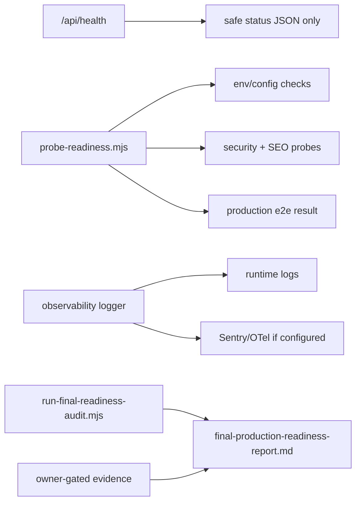

# Phase 17 Pattern Map

**Created:** 2026-06-23
**Status:** Complete

## PATTERN MAPPING COMPLETE

## Summary

Phase 17 should extend existing launch hardening surfaces instead of creating an unrelated audit framework. The closest analogs are Phase 15 security probes, Phase 16 SEO/runbook probes, existing fake-provider Playwright infrastructure, and existing typed env helpers.

## Planned File Map

| New or Modified File | Role | Closest Existing Analog | Notes |
| --- | --- | --- | --- |
| `src/app/api/health/route.ts` | Safe public health route | `src/app/api/search/suggestions/route.ts`, Next route handler docs | Use `Response.json`; no provider payloads or secrets. |
| `src/lib/readiness/status.ts` | Readiness status model and scoring | `src/lib/seo/launch-route-matrix.ts`, `src/lib/env/server.ts` | Keep data typed and testable. |
| `src/lib/readiness/status.test.ts` | Unit tests for status/scoring | `src/lib/seo/launch-route-matrix.ts` tests via probes | Assert safe statuses and owner-gated state handling. |
| `scripts/launch/probe-readiness.mjs` | Deep readiness probe | `scripts/security/probe-production-security.mjs`, `scripts/seo/probe-launch-seo.mjs` | Emit markdown table and exit non-zero on automated blockers. |
| `src/instrumentation.ts` | Next server error capture | local Next instrumentation docs | Place under `src` because app uses a `src` folder. |
| `src/lib/observability/redact.ts` | Strict privacy redaction | `src/lib/shopify/customer-account/client.ts` token redaction | Expand beyond tokens to PII, cart IDs, checkout URLs, payloads. |
| `src/lib/observability/logger.ts` | Typed server logging helper | `src/lib/contact/actions.ts` structured warning helpers | Centralize event names, level, context, and sink selection. |
| `src/lib/observability/logger.test.ts` | Unit coverage for logging/redaction | `src/lib/rate-limit/index.test.ts`, `src/lib/analytics/adapter.test.ts` | Must prove raw PII/provider payloads are excluded. |
| `src/app/(storefront)/cart/checkout/route.ts` | Checkout handoff logging | existing route body | Log ready, terms-required, missing-cart, identity-sync-failed without checkout URL leakage. |
| `src/lib/cart/actions.ts` | Cart and buyer identity logging | existing cart action error handling | Revenue-critical errors become redacted error events. |
| `src/lib/shopify/client.ts` | Storefront API provider logging | existing `shopifyFetch` | Log status/operation safely; do not log queries with variables containing customer data. |
| `src/lib/shopify/customer-account/client.ts` | Customer Account provider logging | existing token redaction | Preserve existing token redaction; log operation/session status safely. |
| `src/lib/searchanise/search.ts` | Search provider logging | existing `createEmptyResult` degradation | Warnings for unavailable/error states; no raw response payloads. |
| `src/lib/reviews/trustoo.ts` | Reviews provider logging | current `console.warn` calls | Replace with structured warning events. |
| `src/lib/contact/actions.ts` | Contact/newsletter/NPD/wholesale logging | current `logProviderWarning/Error` | Route through shared logger; no submitted fields. |
| `src/app/api/webhooks/shopify/route.ts` | Webhook observability | existing HMAC route | Log invalid signatures, accepted topics, ignored topics safely. |
| `src/app/api/webhooks/sanity/route.ts` | Webhook observability | existing Sanity webhook route | Log invalid payload/signature and revalidation tags safely. |
| `playwright.production.config.ts` | Production-like e2e lifecycle | `playwright.config.ts` | Use fake providers plus `next build`/`next start`; no dev server dependency. |
| `tests/e2e/production-smoke.spec.ts` | Production smoke browser coverage | `tests/e2e/cart-checkout.spec.ts`, `tests/e2e/consent.spec.ts` | Keep real Shopify checkout blocked. |
| `scripts/performance/probe-lighthouse.mjs` | Performance audit harness | `scripts/seo/probe-launch-seo.mjs` | Use local `lighthouse` package, emit markdown evidence. |
| `docs/launch/performance-evidence.md` | Performance evidence | `docs/launch/seo-route-evidence.md` | Store route, metric, status, mitigation. |
| `docs/launch/final-production-readiness-report.md` | Final source of truth | `docs/launch/analytics-and-indexing-runbook.md`, `docs/testing/cart-checkout-uat.md` | Separate automated 100/100 from owner-gated launch table. |
| `scripts/launch/run-final-readiness-audit.mjs` | Aggregated final audit runner | `scripts/seo/probe-launch-seo.mjs`, `scripts/security/probe-production-security.mjs` | Orchestrate commands, collect status, write report. |

## Existing Patterns To Preserve

### Route Handlers

- Use named `GET`/`POST` exports.
- Use `Response.json`.
- Keep route output user-safe.
- If dynamic params are introduced, use `params: Promise<{...}>` and `await params` per Next 16.

### Script Probes

Existing probe scripts:

- Parse CLI args manually.
- Print markdown tables.
- Use `process.exitCode = 1` or `process.exit(1)` for failures.
- Escape markdown cells.
- Prefer deterministic source parsing over broad runtime assumptions.

Phase 17 probes should follow that style.

### Env Helpers

Existing env helpers live in:

- `src/lib/env/read.ts`
- `src/lib/env/runtime.ts`
- `src/lib/env/server.ts`
- `src/lib/env/public.ts`
- `src/lib/env/tooling.ts`

Add launch/readiness env access through these boundaries rather than direct scattered `process.env` reads in app code. Tooling scripts may read `process.env`, but should use helper-like parsing functions.

### Redaction

Existing narrow token redaction in `src/lib/shopify/customer-account/client.ts` is a good starting pattern. Phase 17 should generalize it without weakening the Customer Account token behavior.

### Fake Provider Safety

Existing Playwright tests block third-party requests with `tests/mocks/third-party-network.ts` and use fake Shopify/fake Customer Account configs. Production-like e2e must preserve that safety boundary and must not load `myshopify.com/checkouts` or `checkout.shopify.com`.

## Data Flow Notes

## Risk Controls

- Public health must not reveal provider names, env variable names, raw error messages, customer data, cart IDs, checkout URLs, or secrets.
- Logger tests must include examples for email, phone, token, cookie, address-like text, message body, checkout URL, cart ID, and provider payload.
- Final audit must treat owner-gated evidence as a separate launch gate table, not as an automated code failure.
- Production e2e must start and stop its own server lifecycle.

